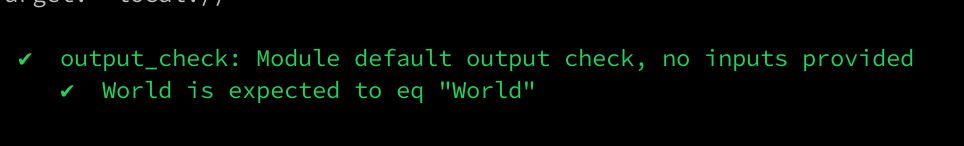

# tf-test-output
Terraform test output

Quote from Zoom call "1) output, test output
2) Default value to the output, 
Variable value - testing "

# Purpose

This repository contains module code and instructions on TF output testing for 2 cases :

- When no input to the module provided, and output should contain the predefined value
- When the user providing some input, and it should be elevated to the output


# Requirements

This project is using [KitchenCI](https://kitchen.ci/). It is written in Ruby, so you will need to have some Ruby version compatible with KitchenCI installed on your workstation. For ways of doing this - please consult your operating system manual, or at least [official Ruby documentation](https://www.ruby-lang.org/en/documentation/installation/). As KitchenCI can utilize other Ruby packages, that are called [RubyGems](https://github.com/rubygems/rubygems), they are often managed by sets or "bundles". To simplify management of these sets we are going to use [Bundler](https://bundler.io/index.html#getting-started) 

To learn more about the mentioned above tools and technologies -  please check section [Technologies near the end of the README](#technologies)

## Terraform

Kitchen-Terraform integrates with the
[Terraform command-line interface](https://www.terraform.io/docs/cli/commands/index.html) to implement a Test Kitchen workflow for Terraform modules. Please follow installation instructions, that can be found in the
[Terraform: Install Terraform](https://www.terraform.io/intro/getting-started/install.html) article.

> Kitchen-Terraform supports versions of Terraform in the interval of
`>= 0.11.4, < 0.15.0`. But this project using code notation of TF 0.12+

## KitchenCI and dependencies

KitchenCI should be installed by following the corresponding official manual from here: https://github.com/newcontext-oss/kitchen-terraform/blob/master/README.md#installation according to your OS and environment. 

> Please note that for your convenience the [Gemfile](https://github.com/Galser/tf-test-output/blob/main/Gemfile) is provided at the root of this repository, which contains all the required packages to successfully install KitchenCI with Bundler. 

# How to test

Once you have all requirements satisfied (e.g. KitchenCI and Terraform installed) you can proceed : 

- To prepare tests, execute from the root folder of the cloned copy of this repo  :

    ```
    bundle exec kitchen converge
    ```

    This will create 2 testing fixtures, and the output going to start with something like this :

    ```
    bundle exec kitchen converge
    -----> Starting Test Kitchen (v2.11.2)
    -----> Creating <default-output-terraform>...
    $$$$$$ Verifying the Terraform client version is in the supported interval of >= 0.11.4, < 0.15.0...
    $$$$$$ Reading the Terraform client version...
       Terraform v0.14.11

    ```

    And in case of a successful run the last 2 lines of output should be  like this : 

    ```
    Finished converging <output-from-variable-terraform> (0m1.72s).
    -----> Test Kitchen is finished. (0m6.11s)    
    ```

- Now to run the test execute : 

    ```
    bundle exec kitchen verify
    ```

    The output should looks like this : 

    ```
     -----> Starting Test Kitchen (v2.11.2)
    -----> Setting up <default-output-terraform>...
           Finished setting up <default-output-terraform> (0m0.00s).
    -----> Verifying <default-output-terraform>...
    $$$$$$ Reading the Terraform input variables from the Kitchen instance state...
    $$$$$$ Finished reading the Terraform input variables from the Kitchen instance state.
    $$$$$$ Reading the Terraform output variables from the Kitchen instance state...
    $$$$$$ Finished reading the Terraform output variables from the Kitchen instance state.
    $$$$$$ Verifying the systems...
    $$$$$$ Verifying the 'basic' system...

    Profile: Kitchen-Terraform test that module has the output with default value while not input provided (default_output)
    Version: 0.1.0
    Target:  local://

      ✔  output_check: Module default output check, no inputs provided
         ✔  World is expected to eq "World"


    Profile Summary: 1 successful control, 0 control failures, 0 controls skipped
    Test Summary: 1 successful, 0 failures, 0 skipped
    $$$$$$ Finished verifying the 'basic' system.
    $$$$$$ Finished verifying the systems.
           Finished verifying <default-output-terraform> (0m2.53s).
    -----> Setting up <output-from-variable-terraform>...
           Finished setting up <output-from-variable-terraform> (0m0.00s).
    -----> Verifying <output-from-variable-terraform>...
    $$$$$$ Reading the Terraform input variables from the Kitchen instance state...
    $$$$$$ Finished reading the Terraform input variables from the Kitchen instance state.
    $$$$$$ Reading the Terraform output variables from the Kitchen instance state...
    $$$$$$ Finished reading the Terraform output variables from the Kitchen instance state.
    $$$$$$ Verifying the systems...
    $$$$$$ Verifying the 'basic' system...

    Profile: Kitchen-Terraform test that module has the output with value equeal to input provided (output_from_variable)
    Version: 0.1.0
    Target:  local://

      ✔  output_check: Module input-based output check
         ✔  Holly is expected to eq "Holly"


    Profile Summary: 1 successful control, 0 control failures, 0 controls skipped
    Test Summary: 1 successful, 0 failures, 0 skipped
    $$$$$$ Finished verifying the 'basic' system.
    $$$$$$ Finished verifying the systems.
           Finished verifying <output-from-variable-terraform> (0m0.57s).
    -----> Test Kitchen is finished. (0m4.20s)
    ```

    And as you can see from the output above - 2 test suits finished with all tests successfully, no errors, no failures. And if you have a color-enabled console there should be green check marks at appropriate messages - 

    

- To destroy the states and free up resource run 
    ```
    bundle exec kitchen destroy
    ```

    Output :
    ```
    -----> Starting Test Kitchen (v2.11.2)
  -----> Destroying <default-output-terraform>...
  $$$$$$ Verifying the Terraform client version is in the supported interval of >= 0.11.4, < 0.15.0...
  $$$$$$ Reading the Terraform client version...
  ...
  $$$$$$ Finished deleting the kitchen-terraform-output-from-variable-terraform Terraform workspace.
         Finished destroying <output-from-variable-terraform> (0m1.84s).
  -----> Test Kitchen is finished. (0m4.89s)
    ```

- All of 3 step's above could be automated via running one command : 
    ```
    bundle exec kitchen test
    ```
This ends up the instructions, thank you. 


# Technologies


-  **To download the content of this repository** you will need **git command-line tools**(recommended) or **Git UI Client**. To install official command-line Git tools please [find here instructions](https://git-scm.com/book/en/v2/Getting-Started-Installing-Git) for various operating systems. 

-  **For managing infrastructure** we using Terraform - open-source infrastructure as a code software tool created by HashiCorp. It enables users to define and provision a data center infrastructure using a high-level configuration language known as Hashicorp Configuration Language, or optionally JSON. More you encouraged to [learn here](https://www.terraform.io). 

- **KitchenCI** - provides a test harness to execute infrastructure code on one or more platforms in isolation. For more details please check the product site : [KitchenCI](https://kitchen.ci/)

- **RubyGems** is a package manager for the Ruby programming language that provides a standard format for distributing Ruby programs and libraries (in a self-contained format called a "gem"), a tool designed to easily manage the installation of gems, and a server for distributing them. More here: https://rubygems.org/

- **Bundler** provides a consistent environment for Ruby projects by tracking and installing the exact gems and versions that are needed. Bundler is an exit from dependency hell, and ensures that the gems you need are present in development, staging, and production. Starting work on a project is as simple as bundle install. In details here: https://bundler.io/index.html#getting-started


# TODO

- [x] create 1-st test 
- [x] run Kitchen, to fail
- [x] make code for test
- [X] update readme
- [X] create additional tests if requried? 
- [X] update readme
